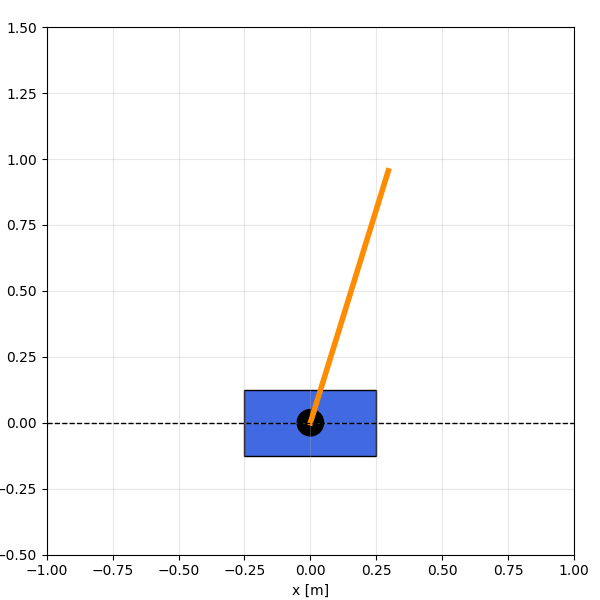
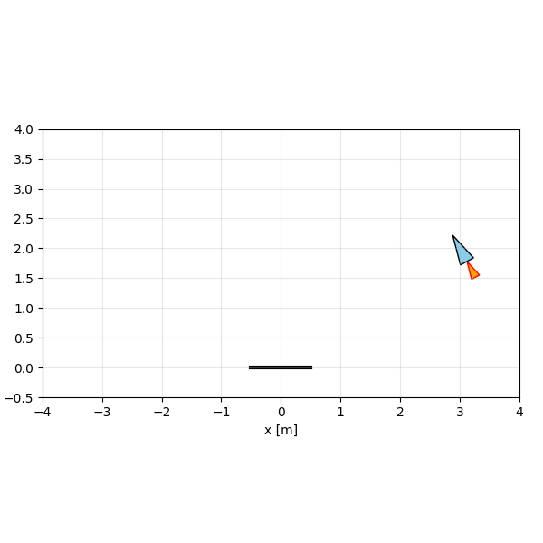
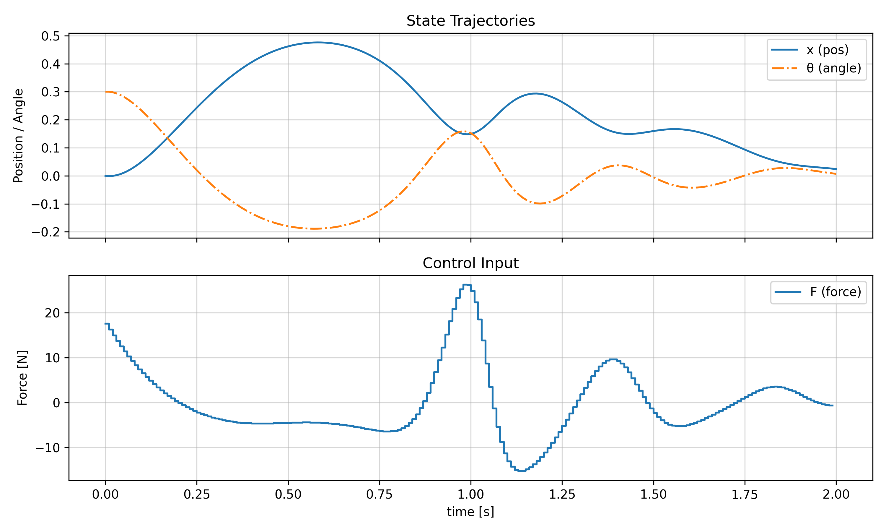
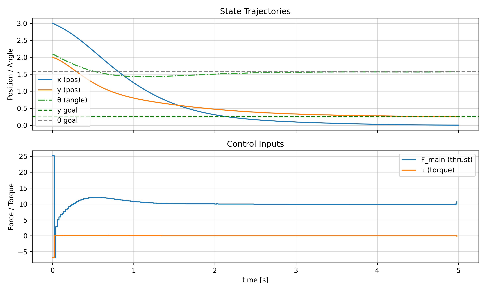

# iLQR Solver

JAX-based implementation of iterative Linear Quadratic Regulator (iLQR) with multiple solver variants.

<div align="center">

| Car Parking | Cart Pole | Rocket Landing |
|:-----------:|:---------:|:--------------:|
|  |  |  |
|  |  |  |

</div>

## Installation

The repo includes a `venv` with all dependencies. Just run:
```bash
make test
```

The Makefile uses the venv automatically—no activation needed.

### Fresh Installation

```bash
# Requires Python 3.10+
python -m venv venv
source venv/bin/activate
pip install -e .
```

Includes **CUDA 12 GPU support** by default. For CUDA 11 or CPU-only, edit `requirements.txt` (see file comments).

## Quick Start

```python
from ilqr import iLQR
import jax.numpy as jnp

# Define your dynamics
def dynamics(state, control):
    # Your dynamics here
    return next_state

# Define your cost
def build_cost():
    def stage_cost(x, u):
        # Stage cost
        return cost_value

    def terminal_cost(x_T):
        # Terminal cost
        return cost_value

    def traj_cost(xs, us):
        # Full trajectory cost
        return total_cost

    return {"stage": stage_cost, "terminal": terminal_cost, "traj": traj_cost}

# Setup and solve
cost = build_cost()
dims = {"state": n, "control": m}
ilqr = iLQR(cost, dynamics, horizon, dims)
(states, controls), (success, stats) = ilqr.solve(x0, u_init)
```

## Running Tests

```bash
make test-all      # Run all tests and generate animations
make test-parking  # Car parking with animation
make test-cartpole # Cart pole balancing with animation
make test-rocket   # Rocket landing with animation
make test-bicycle  # Bicycle navigation with animation
make test-unit     # Unit test for iLQR in a LQ system
```

Tests generate plots and animations in `figures/`.

## Available Solvers

- `LQR` - Linear Quadratic Regulator
- `iLQR` - Iterative LQR for nonlinear systems
- `iLQRAdaptive` - iLQR with variable dynamics
- `iLQRAdaptiveAugmented` - iLQR with constraints (augmented Lagrangian)

## Dependencies

**Python 3.10+** with:
- JAX 0.6.2 (CUDA 12 GPU support)
- NumPy 2.2.6
- Matplotlib 3.10.6
- SciPy 1.15.3

## Fast Iteration

1. Edit `src/ilqr/solvers.py`
2. Run `make test`
3. Check `figures/` for plots

Changes apply immediately (editable install).
